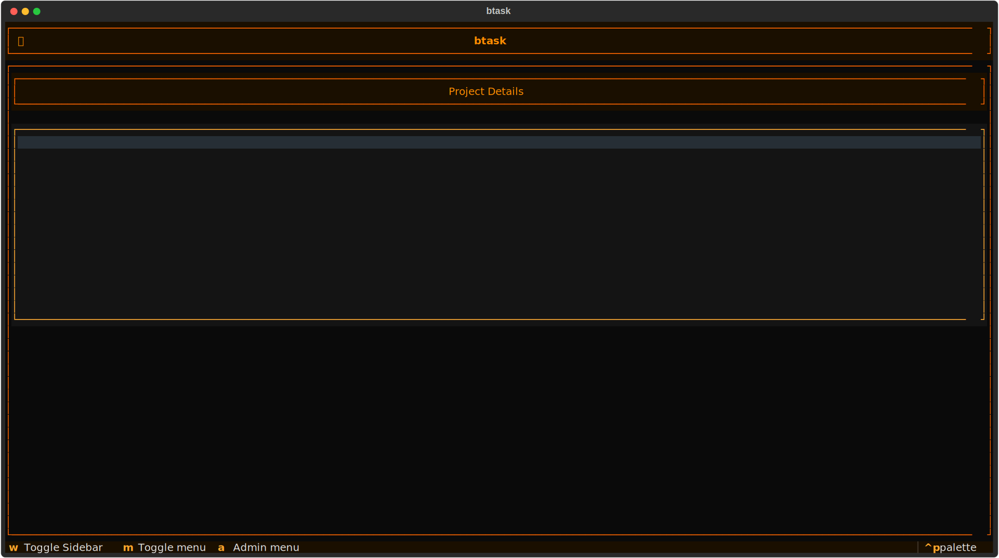

# btask

A terminal based project and kit tracker built with [Textual](https://textual.textualize.io/). Originally designed for managing wireline truck work orders and kit inventories.

### Main Project View


## Features

- **Project Management**: Create, archive, and delete work orders
- **Kit Tracking**: Add, edit, and delete kits within projects
- **Completion Tracking**: Mark kits as complete with a simple click
- **Admin Controls**: PIN-protected administrative functions
- **Persistent Storage**: Cross-platform data storage using platformdirs
- **Retro CRT Theme**: Orange terminal aesthetic inspired by vintage monitors
- **Cross-Platform**: Works on Linux, macOS, and Windows

## Requirements

- Python 3.10 or higher
- [uv](https://github.com/astral-sh/uv) package manager (recommended) or pip

## Installation

### Option 1: Install from source (recommended for development)

```bash
# Clone the repository
git clone https://github.com/chiprek/btask.git
cd btask

# Install with uv
uv sync

# Run the application
uv run python -m btask
```

### Option 2: Install the package locally

```bash
# Build the package
uv build

# Install with uv
uv pip install dist/btask-0.1.0-py3-none-any.whl

# Run from anywhere (with venv activated)
btask
```

### Option 3: Install as a system tool with pipx

```bash
# Build the package first
uv build

# Install with pipx (recommended for system-wide access)
pipx install dist/btask-0.1.0-py3-none-any.whl

# Run from anywhere without activating venv
btask
```

## Configuration

### Admin PIN Setup

btask uses an environment variable for the admin PIN. Create a `.env` file in the project root:

```bash
BTASK_ADMIN_PIN=1234
```

Or set it as a system environment variable:

**Linux/macOS:**
```bash
export BTASK_ADMIN_PIN=1234
```

**Windows (PowerShell):**
```powershell
$env:BTASK_ADMIN_PIN="1234"
```

### Data Storage

btask automatically stores your data in platform-appropriate locations:

- **Linux**: `~/.local/share/btask/`
- **macOS**: `~/Library/Application Support/btask/`
- **Windows**: `%LOCALAPPDATA%\btask\`

Configuration files are stored in:

- **Linux**: `~/.config/btask/`
- **macOS**: `~/Library/Application Support/btask/`
- **Windows**: `%APPDATA%\btask\`

## Usage

### Keyboard Shortcuts

- `w` - Toggle sidebar (project list)
- `m` - Toggle project details menu
- `a` - Open admin menu (requires PIN)
- `Ctrl+Q` - Quit application

### Regular User Operations

- **View Projects**: Press `w` to show/hide the project list
- **Select Project**: Click on a project in the sidebar to view its kits
- **Edit Kit**: Select a kit, press `m`, then click "Edit Kit"
- **Mark Complete**: Click the checkbox (✓) column to toggle completion status

### Admin Operations (PIN Required)

Press `a` to open the admin menu:

- **Add Project**: Create a new work order
- **Delete Project**: Permanently remove a project (with confirmation)
- **Archive Project**: Hide a project from the active list
- **View Archived Projects**: Access and unarchive previously archived projects

## Development

### Project Structure

```
btask/
├── src/
│   └── btask/
│       ├── __init__.py
│       ├── __main__.py          # Entry point
│       ├── app.py               # Main application
│       ├── config.py            # Configuration and data management
│       ├── btask.css            # CRT theme
│       └── widgets/             # UI components
│           ├── sidebar.py
│           ├── project_details.py
│           ├── pd_menu.py
│           └── ...
├── pyproject.toml
├── uv.lock
└── README.md
```

### Running in Development Mode

```bash
# Run with Textual devtools for debugging
uv run textual run --dev src/btask/__main__.py

# Or in two terminals:
# Terminal 1: Start console
uv run textual console

# Terminal 2: Run app
uv run python -m btask
```

### Building

```bash
# Build distribution packages
uv build

# Output will be in dist/:
# - btask-0.1.0.tar.gz (source)
# - btask-0.1.0-py3-none-any.whl (wheel)
```

## Technologies Used

- [Textual](https://textual.textualize.io/) - TUI framework
- [platformdirs](https://github.com/platformdirs/platformdirs) - Cross-platform data directories
- [python-dotenv](https://github.com/theskumar/python-dotenv) - Environment variable management
- [openpyxl](https://openpyxl.readthedocs.io/) - Excel file support (future feature)

## Future Features

- Excel import for bulk kit data
- Progress bar showing project completion percentage
- Search and filter functionality
- Date tracking for kits and projects
- Export to Excel/CSV

## License

This project is licensed under the GNU General Public License v2.0 - see the LICENSE file for details.
This program is free software; you can redistribute it and/or modify it under the terms of the GNU General Public License as published by the Free Software Foundation; either version 2 of the License, or (at your option) any later version.
This program is distributed in the hope that it will be useful, but WITHOUT ANY WARRANTY; without even the implied warranty of MERCHANTABILITY or FITNESS FOR A PARTICULAR PURPOSE. See the GNU General Public License for more details.

## Acknowledgments

Built as a self led project for [boot.dev](https://boot.dev) to get the user out of tutorial hell.

## Contributing

This is a personal learning project, I may continue working on this I may not. If you some how found this and are using it thats pretty neat but do understand I dont really want to fix this if the higher ups do not green light it for internal usage.
